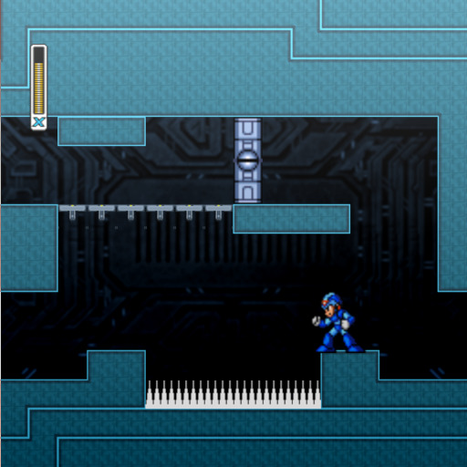

# Deeep

Author: Sebastien Alaiwan

Demo
----

An online demo is available here:

http://code.alaiwan.org/games/deeep

<p align="center"></p>

Description
-----------

This is a demo of a platform-independent C++14 game project.
It uses SDL2, and OpenGL ES 3.0.

It's meant as an example of a platformer/metroidvania game
which can be compiled to native code, or, using Emscripten, to WebAssembly.

The code doesn't contain any reference/dependency to Emscripten, except in the
entry-point file, where the main loop function gets passed to Emscripten.

This code also shows how to isolate your game logic code (doors, switches,
powerups, bullets, ..) from your I/O code (display, audio, input).

Directory structure
-------------------

```
bin/            output directory for architecture-specific executable binaries.
res/            output directory for game resources (e.g. sounds, music, sprites, tilesets).
assets/         source files for game resources.

src/audio/      audio engine (mixing, music playback, channel allocation, etc.)
src/base/       basic types (vectors, matrices, string, span, etc.)
src/engine/     main loop, pause, video capture, composition root
src/entities/   game entity classes (door, switch, bonus, etc.)
src/gameplay/   game logic (physics, triggers, respawn, entity factory, level loading, etc.)
src/misc/       misc utilities (base64, time, gzip, json, etc.)
src/platform/   I/O backends (opengl, SDL audio)
src/render/     display engine (picture loading, sprite batching)
src/tests/      unit tests.

./check:        main check script. Call this to build native and Windows versions and to launch the unit tests.
```


Build
-----

Requirements:
```
* libsdl2-dev
```

The project can be compiled to native code using your native compiler (gcc or clang):

```
$ make
```

The binaries will be generated to a 'bin' directory
(This can be overriden using the BIN makefile variable).

It can also be compiled to WebAssembly, using the Emscripten SDK.

```
$ source /path/to/your/emsdk_env.sh
$ ./scripts/deliver
```

Run the game
------------

Just run the following command:

```
$ bin/rel/game.exe
```

Keys:

- Left/Right: move left/right
- Up/Down: climb up/down ladder
- Z: shoot (if available)
- X: jump
- C: dash (if available)

- PrintScr: take a screenshot.
- Ctrl+PrintScr: toggle video capture.

Convert a screenshot to PNG
---------------------------

```
ffmpeg -f rawvideo -pixel_format rgba -video_size 768x768 -framerate 25 -i screenshot.rgba -y screenshot.png
```

Thanks to:
----------

- llexandro from DevianArt (Textures)

